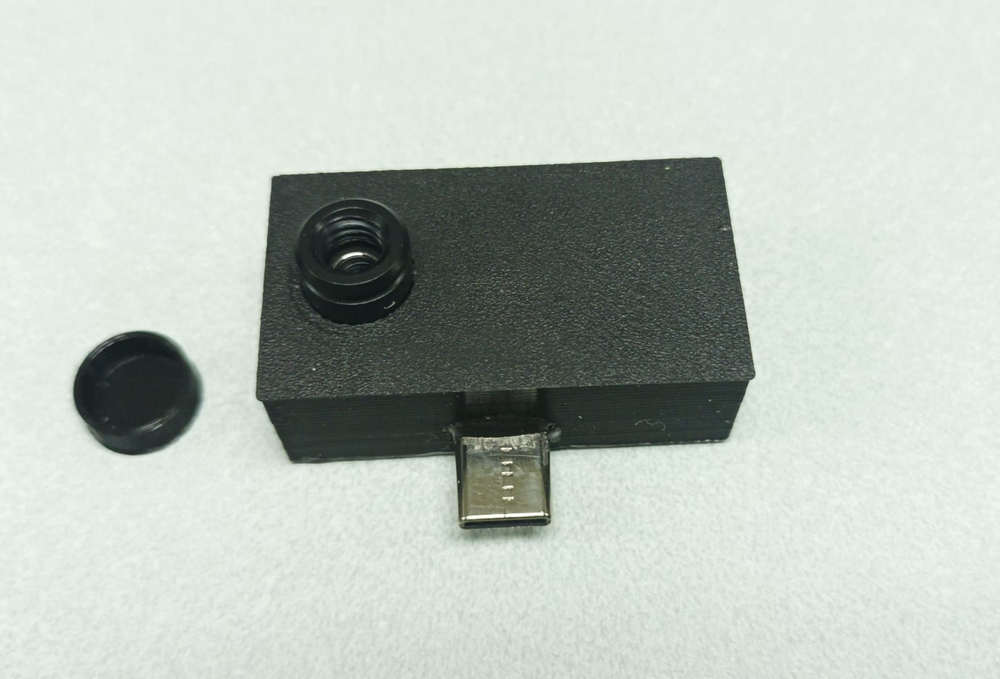
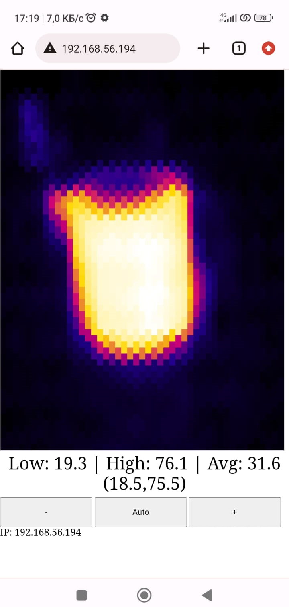

# ESP32-S Thermal Camera

MLX90640 thermal camera connected to a ESP32-S

Arduino IDE 1.8.18  with ESP32 2.0.13 and WebSockets 2.4.0

## Instructions

1. Verify and download sketch to ESP32-S

## Operation

1. ESP32-S will connect to your mobile phone Wifi hotspot
2. Scan ESP32 IP
3. Access ESP32 IP with web browser

## Parts used

1. ESP-32S module
2. MLX90640 camera
3. 3.3V voltage regulator
4. Type-C male connector
5. Wires

